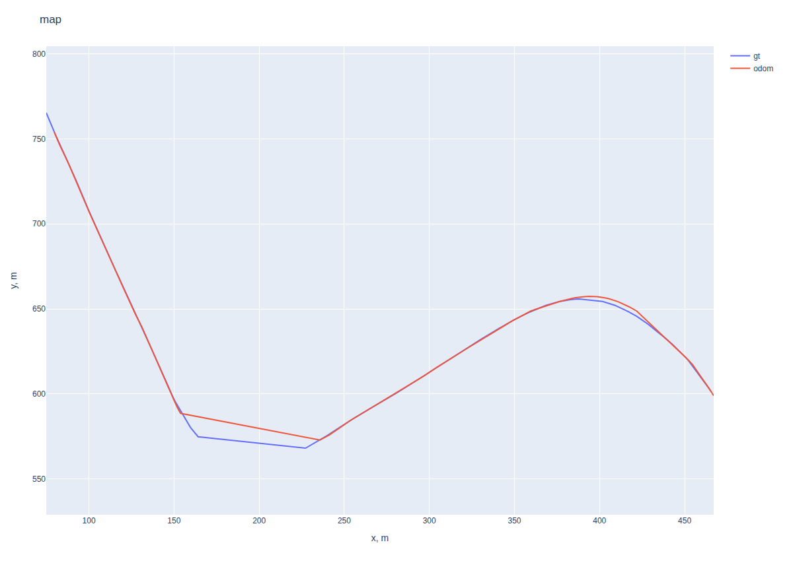
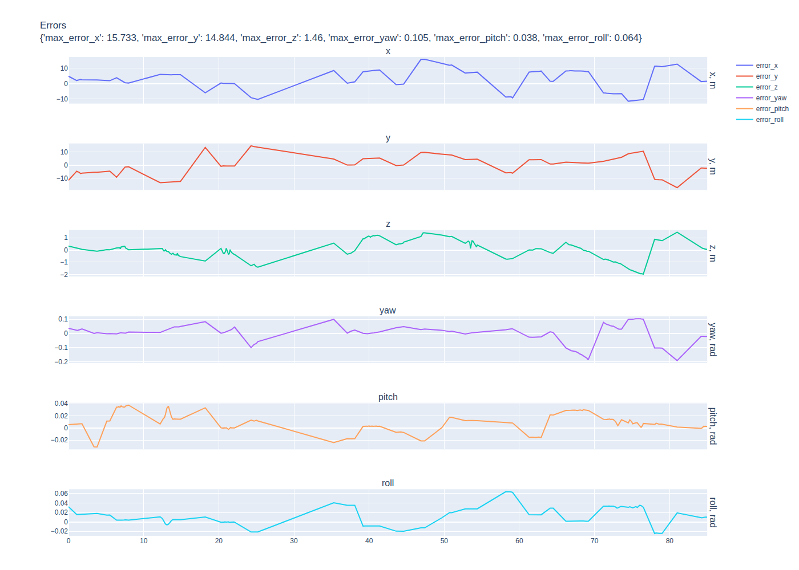

# Ground Aware LiDAR Odometry

`ground_aware_lidar_odometry` is a ROS 2 Humble LiDAR odometry workspace for a
ground-aware pipeline. It deskews LiDAR scans, extracts ground patches and
planar line features, registers the current frame against sliding local maps,
and compares the estimate against GNSS/pure-state reference data when available.

The repository is laid out as a complete ROS 2 workspace:

- `ros2_ws/src/ground_aware_lidar_odometry` - GALO nodes, components, launch,
  config, messages, and tuning scripts.
- `ros2_ws/src/static_tf_publisher` - static sensor transform publisher used by
  the launch files and sweep script.
- `ros2_ws/src/common_msgs` and `ros2_ws/src/qarl_msgs` - message packages used
  by the pipeline.
- `ros2_ws/report_processor.ipynb` - report CSV parser and Plotly figure
  exporter.
- `docs/report_figures` - exported figures used in this README.

## Pipeline

The runtime pipeline is split into three ROS nodes:

1. `deskew_node` subscribes to raw LiDAR, IMU, wheel speed, and wheel angle
   topics, then publishes `/GALO/deskewed_cloud`.
2. `frontend_node` consumes the deskewed cloud, segments ground, extracts ground
   patches and planar lines, and publishes `/GALO/frame_features` plus debug
   clouds/markers.
3. `node` consumes frame features, GNSS/reference data, IMU, and wheel data,
   runs prediction plus ground/planar registration, updates sliding maps, and
   publishes estimated pose/debug topics.

The default launch file starts all three nodes with the shared parameter file
`ros2_ws/src/ground_aware_lidar_odometry/config/galo_params.yaml`.

## Dependencies

Install ROS 2 Humble and common package dependencies:

```bash
sudo apt update
sudo apt install \
  ros-humble-pcl-conversions \
  ros-humble-pcl-ros \
  ros-humble-tf2-ros \
  ros-humble-tf2-sensor-msgs \
  libpcl-dev \
  libeigen3-dev
```

For report parsing and Plotly image export:

```bash
python3 -m pip install numpy pandas plotly nbformat kaleido
```

`kaleido` is required by Plotly `fig.write_image(...)`.

## Build

From the repository root:

```bash
cd /home/kkagirins/dev/lidar-odometry-light/ros2_ws
colcon build
source install/setup.bash
```

Build only the main package during development:

```bash
colcon build --packages-select ground_aware_lidar_odometry
source install/setup.bash
```

The package installs these executables:

- `ros2 run ground_aware_lidar_odometry deskew_node`
- `ros2 run ground_aware_lidar_odometry frontend_node`
- `ros2 run ground_aware_lidar_odometry node`
- `ros2 run ground_aware_lidar_odometry galo_param_sweep.py`

## Launch

Run the standard non-composed pipeline:

```bash
ros2 launch ground_aware_lidar_odometry galo.launch.py
```

Run with bag/simulation time:

```bash
ros2 launch ground_aware_lidar_odometry galo.launch.py use_sim_time:=true
```

Launch GALO and the static TF publisher together:

```bash
ros2 launch ground_aware_lidar_odometry galo.launch.py \
  use_sim_time:=true \
  launch_static_tf:=true
```

Run the composed/component container variant:

```bash
ros2 launch ground_aware_lidar_odometry galo_composed.launch.py \
  use_sim_time:=true \
  launch_static_tf:=true
```

Run static TF separately:

```bash
ros2 launch static_tf_publisher static_tf.launch.py
```

Optional Foxglove bridge:

```bash
ros2 launch foxglove_bridge foxglove_bridge_launch.xml
```

## Bag Replay

Replay the known GALO test bag with the topics required by the configured
pipeline:

```bash
ros2 bag play 109_2025-08-14-19-24-54_1213e_ros2 \
  --clock \
  --topics \
    /tf \
    /Sensor/imu_front/data \
    /Sensor/lidar_front/rslidar_points \
    /Sensor/gnss/trimble_nmea_gga \
    /Sensor/gnss/orientation \
    /SC/state \
    /SC/pure_state \
    /FB/wangle_feedback \
    /FB/wheel_speed_feedback \
  -r 0.5
```

The parameter sweep config uses another default bag path:

```yaml
bag: /ros2_ws/BAGS/109_2025-08-14-19-24-29_1212e_ros2
```

The sweep script replays it internally as:

```bash
ros2 bag play /ros2_ws/BAGS/109_2025-08-14-19-24-29_1212e_ros2 --clock 100 --rate 1.0
```

## Parameters

The main configuration lives in
`ros2_ws/src/ground_aware_lidar_odometry/config/galo_params.yaml`.

Important groups:

- `topics` - all input, intermediate, debug, and output topic names.
- `frames` - IMU, LiDAR, GNSS antenna, map, GNSS map, and body frames.
- `deskew` - scan timing, queue sizes, speed age, and multithreading.
- `segmentation.common` and `segmentation.ground` - range limits and ground
  grid settings.
- `ground_patch` - ground patch size, point count, thickness, normal, and
  marker settings.
- `ground_registration` and `ground_registration_gate_params` - patch matching,
  z/roll/pitch solve limits, IMU prior, conditioning, and acceptance gates.
- `planar_registration` and `planar_registration_gate_params` - planar line
  extraction, matching, damping, priors, and acceptance gates.
- `prediction` - wheel-model geometry, residual gates, steering correction,
  pitch-to-z behavior, and data age limits.
- `pose_merge` - smoothing and fallback blending coefficients.
- `node.odom_error_csv_enabled` and `node.odom_error_csv_path` - report CSV
  output consumed by the notebook and tuning script.

## Parameter Tuning

Use the GALO sweep script for repeatable bag-based tuning:

```bash
cd /home/kkagirins/dev/lidar-odometry-light/ros2_ws
source install/setup.bash
ros2 run ground_aware_lidar_odometry galo_param_sweep.py
```

Or run the source script directly:

```bash
python3 src/ground_aware_lidar_odometry/scripts/galo_param_sweep.py \
  src/ground_aware_lidar_odometry/scripts/galo_param_sweep.yaml
```

The default config is
`ros2_ws/src/ground_aware_lidar_odometry/scripts/galo_param_sweep.yaml`.
It defines:

- `bag`, `base_params`, `out_dir`, `setup`, and optional `write_best`.
- execution settings such as `use_sim_time`, `launch_static_tf`, `rate`,
  `bag_timeout_sec`, `dry_run`, and `resume`.
- scoring weights for xy, yaw, z, roll/pitch, max/final xy error, and planar
  gate rate.
- staged search over `planar`, `ground`, `prediction`, and `gates_smoothing`.

Typical flow:

1. Start with `search.stages: [planar, ground]`.
2. Once feature quality is stable, tune `prediction`.
3. Finish with `gates_smoothing`.
4. Inspect `${out_dir}/summary.csv`.
5. Use `${out_dir}/best_galo_params.yaml` as the candidate parameter file.

Useful sweep outputs:

- `summary.csv` - one row per candidate, lower `score` is better.
- `best_galo_params.yaml` - best parameter set in normal GALO YAML form.
- `<candidate>.yaml` - generated params for each run.
- `<candidate>.csv` - odometry error report from GALO.
- `<candidate>.*.log` - static TF, node, and bag replay logs.

## Report Parsing

`ros2_ws/report_processor.ipynb` reads the GALO report CSV, builds Plotly
trajectory/error plots, and saves README-ready images to `docs/report_figures`.

Default report path inside the ROS workspace/container:

```text
/ros2_ws/galo_odometry_error_rep.csv
```

Fallback path when running the notebook from `ros2_ws`:

```text
galo_odometry_error_rep.csv
```

After installing `kaleido`, rerun the notebook to refresh:

- `docs/report_figures/trajectory_map.png`
- `docs/report_figures/odometry_errors.png`

### Trajectory



### Odometry Errors



## ROS Interfaces

Main subscribed topics from `galo_params.yaml`:

| Topic | Role |
| --- | --- |
| `/Sensor/lidar_front/rslidar_points` | Raw LiDAR cloud |
| `/Sensor/imu_front/data` | IMU orientation/angular velocity |
| `/Sensor/gnss/trimble_nmea_gga` | GNSS position/reference |
| `/Sensor/gnss/orientation` | GNSS orientation/reference |
| `/SC/pure_state` | Reference vehicle state |
| `/FB/wheel_speed_feedback` | Wheel speed prediction input |
| `/FB/wangle_feedback` | Steering angle prediction input |
| `/GALO/deskewed_cloud` | Frontend input from deskew node |
| `/GALO/frame_features` | Backend input from frontend node |

Main published/debug topics:

| Topic | Role |
| --- | --- |
| `/GALO/deskewed_cloud` | Deskewed point cloud |
| `/GALO/deskewed_cloud_heartbeat` | Deskew heartbeat |
| `/GALO/frame_features` | Extracted planar lines and ground patches |
| `/GALO/colored_cloud` | Ground/non-ground debug cloud |
| `/GALO/ground_patch_normals` | Ground patch normal markers |
| `/GALO/planar_line_markers` | Planar line markers |
| `/GALO/gt_eulers` | Reference roll/pitch/yaw debug |
| `/GALO/est_eulers` | Estimated roll/pitch/yaw debug |
| `/GALO/pure_state_eulers` | Pure-state roll/pitch/yaw debug |
| `/GALO/true_pose` | Reference pose with covariance |
| `/GALO/estimate_pose` | Estimated pose with covariance |
| `/GALO/speed` | Speed debug output |

## TF Requirements

GALO expects the configured sensor frames to be available:

- `frames.imu_frame: imu`
- `frames.lidar_frame: rslidar`
- `frames.pos_antenna_frame: pos_antenna`
- `frames.orientation_antenna_frame: orientation_antenna`
- `frames.body_frame: base_link`
- `frames.map_frame: map`
- `frames.gnss_map_frame: gnss_map`

Use the packaged static TF launch when the calibrated transforms are provided in
`ros2_ws/src/static_tf_publisher/config/sensor_transforms.yaml`:

```bash
ros2 launch static_tf_publisher static_tf.launch.py
```

## Debugging

Recommended RViz/Foxglove displays:

- `/GALO/deskewed_cloud`
- `/GALO/colored_cloud`
- `/GALO/ground_patch_normals`
- `/GALO/planar_line_markers`
- `/GALO/true_pose`
- `/GALO/estimate_pose`
- TF tree

Useful checks while tuning:

- `planar_gate_ok` should stay high in the report CSV.
- `planar_matches` should not collapse for long intervals.
- Ground registration should not introduce large roll/pitch jumps.
- `error_z`, `error_roll`, and `error_pitch` should remain bounded.
- `max_error_x`, `max_error_y`, and `max_error_yaw` in the CSV should improve
  after each accepted sweep stage.

## Known Limitations

- The project is experimental and oriented toward bag-driven development.
- Local maps are sliding windows, not a global optimization backend.
- Planar registration can fail in open areas with too few stable non-ground
  lines.
- Ground registration is sensitive to sparse or misclassified ground patches.
- Good static TF calibration is required for IMU/LiDAR/GNSS consistency.
- Plotly PNG export from the notebook requires `kaleido`.

## License

TODO.
